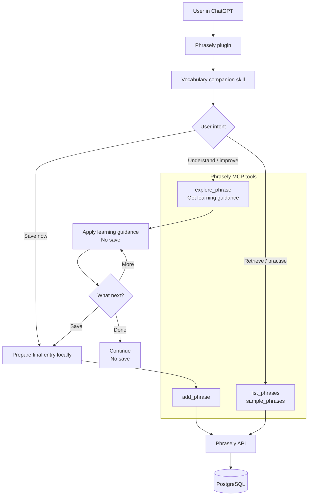

# Phrasely

A personal vocabulary tool for collecting English phrases from real life, with AI-powered curation and a word cloud that grows as you learn.

Production: [getphrasely.com](https://getphrasely.com)

## How It Works

1. **Capture** a phrase, sentence fragment, or even a single word you encounter in a podcast, book, movie, article, or conversation.
2. **Curate with AI** to enrich missing context, correct grammar, add clear definitions, attach Merriam-Webster links, and generate useful notes.
3. **Build your vocabulary** by saving curated phrases to your personal collection.
4. **Review and reinforce** in Shuffle mode, which presents one phrase at a time for focused learning.
5. **Visualize your progress** with the Vocabulary Bubble, where the expressions you revisit most often grow larger over time.

The goal is simple: turn interesting words and expressions you hear in everyday life into part of your active vocabulary.

## ChatGPT Plugin Flow

The plugin bundles a vocabulary-companion skill with the existing Phrasely MCP app. The skill recognizes the user's intent and chooses the workflow; MCP tools provide authenticated access to the user's phrase collection.

## Documentation

- [docs/local-development.md](docs/local-development.md) — local setup and day-to-day commands
- [docs/frontend-architecture.md](docs/frontend-architecture.md) — frontend/API flow and cookie auth model
- [docs/auth-magic-link.md](docs/auth-magic-link.md) — magic link authentication flow
- [docs/mcp-server.md](docs/mcp-server.md) — MCP server architecture and OAuth 2.1 flow
- [mcp/README.md](mcp/README.md) — running and testing the MCP server locally
