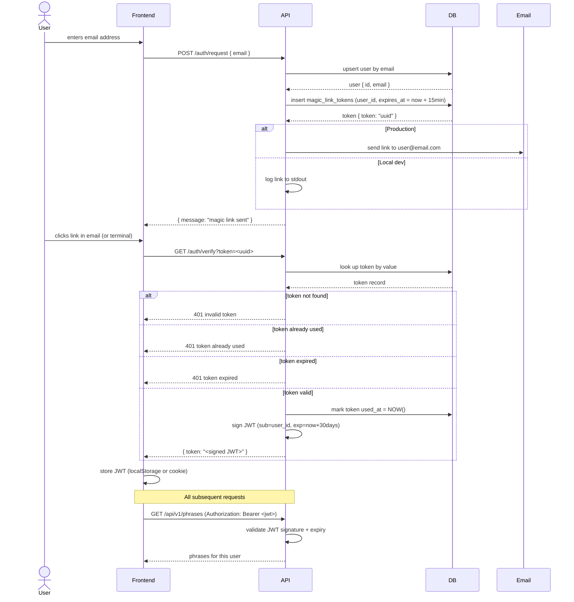

# Magic Link Auth Flow

## How it works

## Key properties

| Property | Value |
|---|---|
| Magic link TTL | 15 minutes |
| JWT TTL | 30 days |
| Token reuse | Not allowed — marked used on first click |
| Token storage | DB (`magic_link_tokens` table) |
| JWT storage | Frontend only (never in DB) |
| JWT signing | HMAC-SHA256 with `JWT_SECRET` env var |

## Local dev

The magic link is logged to the API stdout instead of being emailed.
Run `docker compose logs api` after calling `POST /auth/request` and click the link directly from the terminal.
