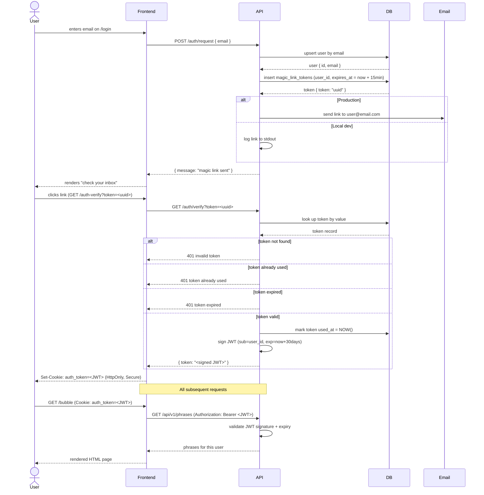

# Magic Link Auth Flow

## How it works

## Key properties

| Property | Value |
|---|---|
| Magic link TTL | 15 minutes |
| JWT TTL | 30 days |
| Token reuse | Not allowed — marked used on first click |
| Token storage | DB (`magic_link_tokens` table) |
| JWT storage | Browser cookie (`auth_token`, `HttpOnly`, `Secure` in production) |
| Cookie content | JWT (not a random session ID) |
| JWT signing | HMAC-SHA256 with `JWT_SECRET` env var |

## Security trade-off

The previous session-ID approach was more secure in theory because the JWT never touched the browser.
In practice, both approaches rely on the same browser protections that we still enforce now: `HttpOnly`, `Secure` (in production), and `SameSite=Lax`.

The main capability we gave up is immediate server-side revocation. With a session store, deleting the server entry invalidates access instantly. With a signed JWT cookie, revocation is not immediate unless extra infrastructure is added (for example, a denylist or short-lived access tokens plus refresh rotation).

At the current scale (personal app, around 50 users), we are prioritizing a smoother UX that avoids forced re-logins on frontend restarts/redeploys.
As usage grows or revocation requirements become stricter, we should revisit the session-ID model (or an equivalent revocation-capable design).

## Local dev

The magic link is logged to the API stdout instead of being emailed.
Run `docker compose logs api` after submitting your email and click the link directly from the terminal.
