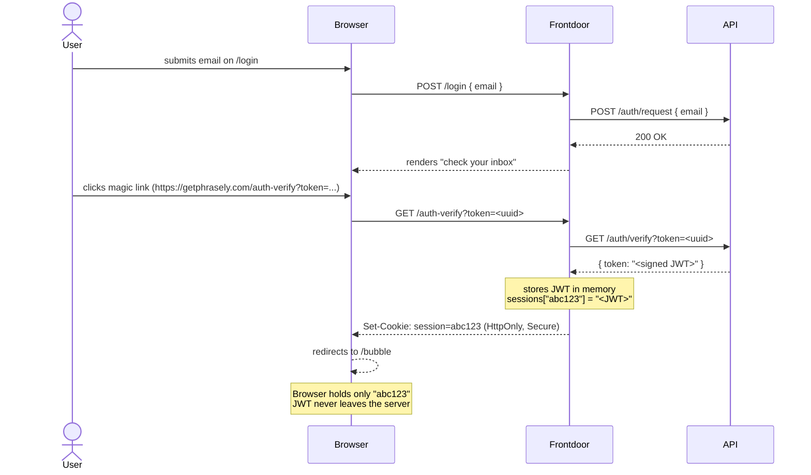
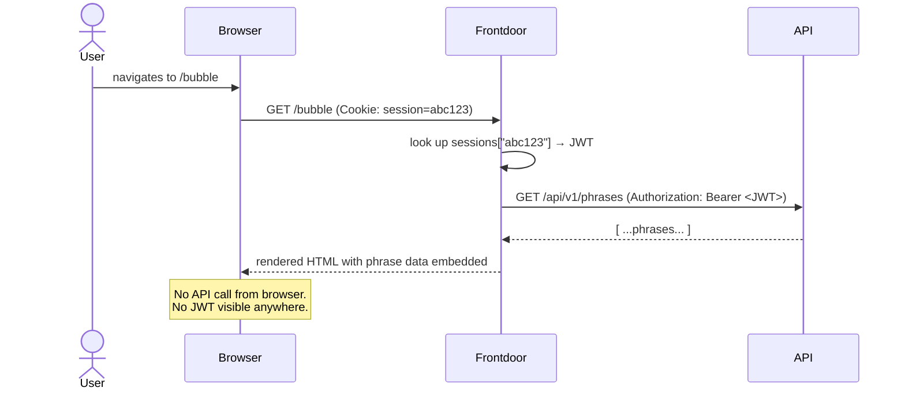
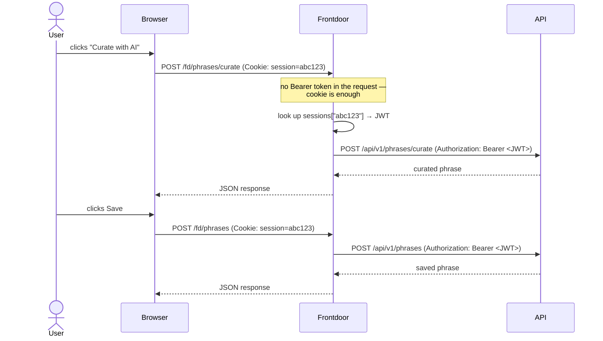

# Frontdoor Architecture

The frontdoor is a Go HTTP server that sits between the browser and the private API.
The browser never talks to the API directly — not even through a proxy that exposes raw API routes.

## Components

```
┌─────────────────────────────────────────────────────────────┐
│                        Internet                             │
└───────────────────────────┬─────────────────────────────────┘
                            │ HTTPS
                            ▼
                    ┌───────────────┐
                    │   Frontdoor   │  public (Railway URL / getphrasely.com)
                    │   Go server   │  handles pages + /fd/ proxy
                    └───────┬───────┘
                            │ internal network only
                            │ http://phrasely.railway.internal:8080
                            ▼
                    ┌───────────────┐
                    │      API      │  private — no public URL
                    │   Go server   │  JWT-authenticated
                    └───────┬───────┘
                            │
                            ▼
                    ┌───────────────┐
                    │  PostgreSQL   │  private
                    └───────────────┘
```

## Sign-in flow



## Page request flow



## Interactive actions via /fd/

For actions that need JS interactivity (edit, delete, curate), the browser calls
`/fd/*` endpoints on the frontdoor. The frontdoor looks up the JWT from the session
and forwards the request to the private API.



## Session cookie vs JWT in localStorage

| | localStorage (insecure) | Frontdoor session cookie |
|---|---|---|
| Auth token in browser | Full JWT | Random session ID only |
| Readable by JavaScript | Yes — `localStorage.getItem(...)` | No — `document.cookie` returns empty |
| Visible in DevTools | Application → Local Storage | Application → Cookies (ID only, not JWT) |
| JWT leaves the server | Yes | Never |
| Stolen token risk | Copy JWT, use anywhere | Session ID useless without server |

## Key properties

| Property | Value |
|---|---|
| Session storage | In-memory map on frontdoor (resets on restart) |
| Session TTL | 30 days (matches JWT expiry) |
| Session ID | 32-char random hex string |
| Cookie flags | `HttpOnly`, `Secure` (in production), `SameSite=Lax` |
| `/fd/` routes | Session-authenticated, proxy to private API |
| API exposure | No public URL — only reachable via frontdoor on `railway.internal` |
