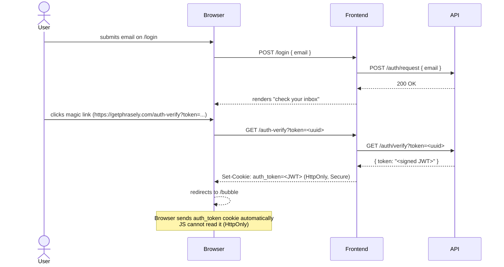
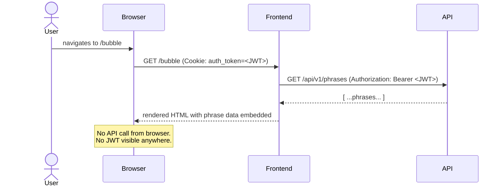
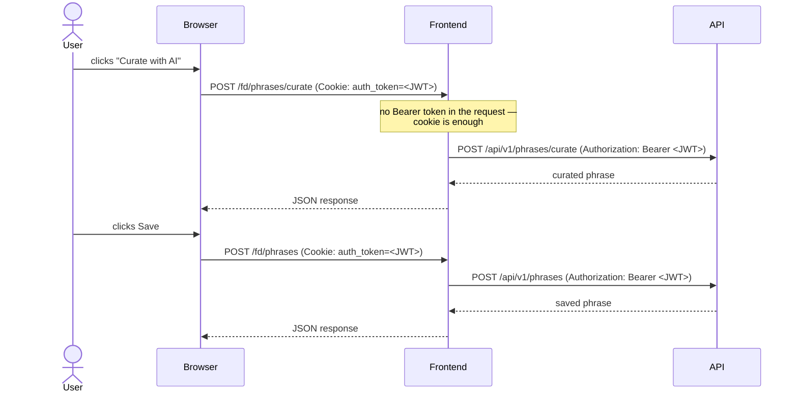

# Frontend Architecture

The frontend is a Go HTTP server that sits between the browser and the private API.
The browser never talks to the API directly — not even through a proxy that exposes raw API routes.

## Components

```
┌─────────────────────────────────────────────────────────────┐
│                        Internet                             │
└───────────────────────────┬─────────────────────────────────┘
                            │ HTTPS
                            ▼
                    ┌───────────────┐
                    │   Frontend   │  public (Railway URL / getphrasely.com)
                    │   Go server   │  handles pages + /fd/ proxy
                    └───────┬───────┘
                            │ internal network only
                            │ http://phrasely.railway.internal:8080
                            ▼
                    ┌───────────────┐
                    │      API      │  private — no public URL
                    │   Go server   │  JWT-authenticated
                    └───────┬───────┘
                            │
                            ▼
                    ┌───────────────┐
                    │  PostgreSQL   │  private
                    └───────────────┘
```

## Sign-in flow



## Page request flow



## Interactive actions via /fd/

For actions that need JS interactivity (edit, delete, curate), the browser calls
`/fd/*` endpoints on the frontend. The frontend reads the JWT from the
`auth_token` cookie and forwards the request to the private API.



## Key properties

| Property | Value |
|---|---|
| Auth storage | Browser cookie (`auth_token`) |
| Cookie TTL | 30 days (matches JWT expiry) |
| Cookie content | Signed JWT |
| Cookie flags | `HttpOnly`, `Secure` (in production), `SameSite=Lax` |
| `/fd/` routes | Cookie-authenticated, proxy to private API |
| API exposure | No public URL — only reachable via frontend on `railway.internal` |

## Security trade-off

The old session-ID design was more secure in theory because the JWT stayed server-side.
The practical XSS protection is still strong in this design because the auth cookie is protected by `HttpOnly`, `Secure` (in production), and `SameSite=Lax`.

The real trade-off is revocation behavior:

- Session store model: immediate server-side invalidation by deleting the session record.
- JWT cookie model: token remains valid until expiry (30 days) unless explicit revocation infrastructure is added.

At the current product size (personal app, around 50 users), we are prioritizing a smoother experience that avoids forced re-logins on frontend restarts/redeploys.
As the platform grows, we should revisit a session-ID model (or another revocation-capable approach) to improve immediate invalidation controls.
