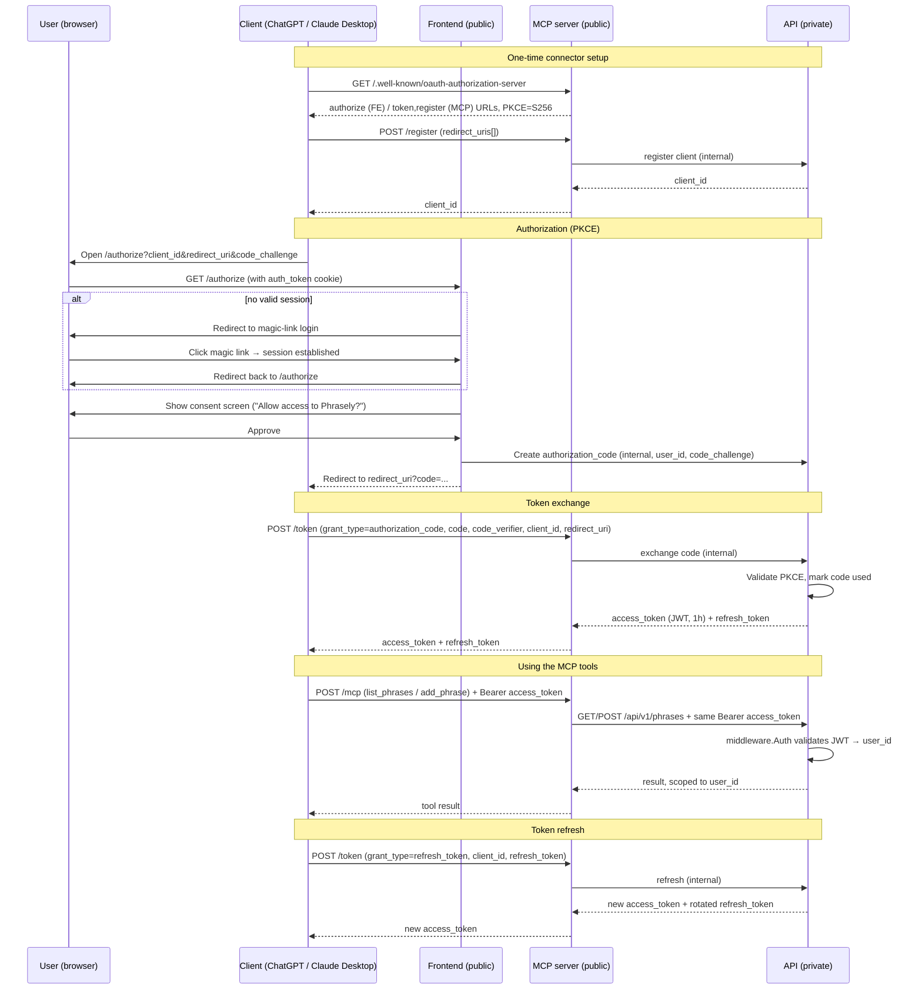

# MCP Server

Exposes `list_phrases` and `add_phrase` over MCP (Streamable HTTP), backed by the
private `backend` API. Deployed as a separate public Railway service alongside `frontend`.

## Architecture

`mcp` is a thin public adapter in front of the private `backend` API. It has no direct
DB connection and shares no Go `internal/` packages with `backend` — it is purely an HTTP
client of the private API, the same role `frontend/api.go` plays.

```
Internet
   │ HTTPS
   ▼
┌─────────────────────────────────────────────────┐
│  MCP server (public)        Frontend (public)   │
│  mcp:8081                   frontend:3000        │
└───────────────┬─────────────────────┬───────────┘
                │ internal network    │
                ▼                     ▼
        ┌───────────────────────────────────┐
        │         API (private)             │
        │         backend:8080              │
        └───────────────────────────────────┘
                        │
                        ▼
                  PostgreSQL
```

Tool calls forward the caller's Bearer JWT straight through to `backend`, so
`middleware.Auth` and per-`user_id` scoping work unchanged — `mcp` never inspects JWT
internals beyond passing the header along.

## Auth: OAuth 2.1 + PKCE

In production, all auth goes through OAuth 2.1. `/mcp` requires `Authorization: Bearer <access_token>`. For local ad-hoc testing, a magic-link JWT works directly as the Bearer token (see [mcp/README.md](../mcp/README.md)).

OAuth *logic and storage* (tables, code generation, token minting) live in `backend`.
The *endpoints that clients call directly* are hosted/proxied by `mcp` — calling `backend`
internally for the actual work.

### Discovery endpoints (hosted by `mcp`)

- `/.well-known/oauth-authorization-server` (RFC 8414) — advertises `/authorize` (on
  `frontend`), `/token` and `/register` (on `mcp`), PKCE method (`S256`).
- `/.well-known/oauth-protected-resource` (RFC 9728) — points the MCP resource at the
  auth server above.

### Dynamic Client Registration — `POST /register` (proxied to `backend`)

Client POSTs a `redirect_uris` array (RFC 7591), gets back a `client_id` (public client, no secret —
PKCE is mandatory). Redirect URIs are pinned at registration and validated on every
`/authorize` call (open-redirect defense).

### `/authorize` (frontend, public)

If the request has a valid `auth_token` cookie (existing magic-link session), shows a
consent screen ("Allow access to your Phrasely phrases?") and issues an authorization
code via an internal call to `backend`. If not logged in, redirects into the magic-link
flow, then bounces back to `/authorize` to complete.

### `/token` (proxied to `backend`)

Client POSTs `grant_type=authorization_code`, `code`, `code_verifier`, `client_id`, and `redirect_uri`. `backend` validates the PKCE challenge, marks the code used, and mints:
- **access_token** — JWT (1h expiry), same format as `auth.signJWT`, so `middleware.Auth`
  works unchanged.
- **refresh_token** — DB-persisted for revocation and rotation.

Refresh token rotation is enforced: old token is atomically revoked, new one issued on
every `refresh_token` grant.

### DB tables (in `backend`)

| Table | Purpose |
|---|---|
| `oauth_clients` | `client_id`, pinned `redirect_uris[]`, `created_at` |
| `oauth_authorization_codes` | `code`, `client_id`, `user_id`, `redirect_uri`, `code_challenge`, `expires_at` (~60s), `used_at` |
| `oauth_refresh_tokens` | long-lived tokens for rotation and revocation |

## Full auth flow



**Why PKCE?** Clients like ChatGPT and Claude Desktop are public clients that cannot
keep a `client_secret`. PKCE fixes the interception risk: the `code_challenge` (SHA-256
hash) is sent upfront; the `code_verifier` (the pre-image) is sent only at token
exchange. An intercepted `code` is useless without the `code_verifier`.

## MCP tools

| Tool | Maps to |
|---|---|
| `list_phrases(headword?)` | `GET /api/v1/phrases` (optional `?headword=` filter) |
| `add_phrase(...)` | `POST /api/v1/phrases` |

## Local testing

See [mcp/README.md](../mcp/README.md) for local setup, quick JWT testing, MCP Inspector
usage, and Claude Desktop configuration.
