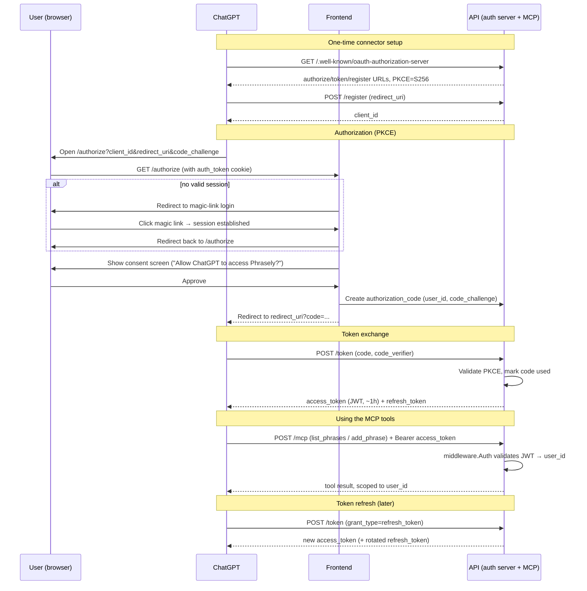
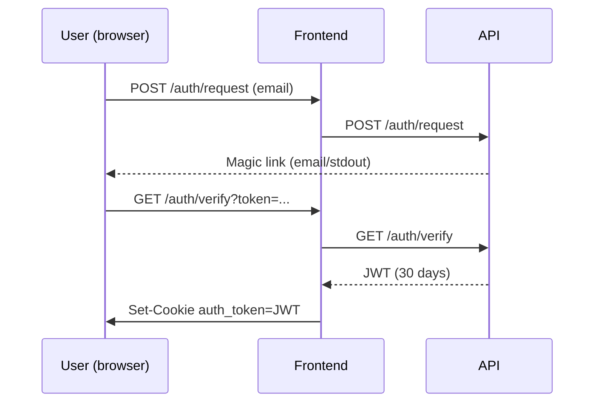

# MCP Server Plan

Goal: expose `list_phrases` and `add_phrase` over MCP (Streamable HTTP) so Phrasely can be
added as a ChatGPT connector, with the same per-user scoping and security guarantees as the
REST API.

## Phase 1 — MCP server with static token auth

- New `backend/internal/mcp` package + `backend/cmd/mcp` entrypoint (or an `mcp` mode in the
  existing API binary), implementing an MCP Streamable HTTP server using a Go MCP SDK
  (`mark3labs/mcp-go` or `modelcontextprotocol/go-sdk`).
- Two tools, backed by the existing `db.Store` methods:
  - `list_phrases(headword?)` → `db.Store.ListPhrases` (same as `GET /api/v1/phrases`)
  - `add_phrase(...)` → `db.Store.CreatePhrase` (same validation as `POST /api/v1/phrases`,
    optionally piped through the existing `curate` step)
- Auth: reuse `middleware.Auth` and the existing JWT — a static long-lived JWT works for
  local testing via MCP Inspector or Claude Desktop config (`http://localhost:8080/mcp`).
- All tool calls scoped to `user_id` from the JWT, exactly like the REST endpoints — no new
  authorization logic.

**Outcome of Phase 1**: working MCP server, testable end-to-end locally against the
docker-compose stack, but not yet usable as a ChatGPT connector (ChatGPT requires OAuth).

## Phase 2 — OAuth 2.1 + Dynamic Client Registration

Required for ChatGPT's remote connector flow. Reuses the existing JWT format and the
frontend's `auth_token` cookie / magic-link login — no new login mechanism.

### 1. Discovery endpoints (API)
- `/.well-known/oauth-authorization-server` (RFC 8414) — advertises `/authorize`, `/token`,
  `/register`, supported grant types (`authorization_code`), PKCE method (`S256`).
- `/.well-known/oauth-protected-resource` (RFC 9728) — points the MCP resource at the auth
  server above.

### 2. Dynamic Client Registration — `/register`
- ChatGPT POSTs its `redirect_uri`, gets back a `client_id` (public client, no secret —
  PKCE is mandatory).
- New `oauth_clients` table: `id, redirect_uris[], created_at`. Redirect URI is pinned at
  registration and validated on every `/authorize` call (open-redirect defense).

### 3. `/authorize` (frontend)
- If the request has a valid `auth_token` cookie (existing magic-link session), show a
  one-time consent screen ("Allow ChatGPT to read/add your Phrasely phrases?") and issue an
  authorization code.
- If not logged in, redirect into the existing magic-link flow, then bounce back to
  `/authorize` to complete.
- New `oauth_authorization_codes` table: `code, client_id, user_id, redirect_uri,
  code_challenge, expires_at (~60s), used_at` — single-use, short-lived.

### 4. `/token` (API)
- ChatGPT POSTs `code` + PKCE `code_verifier`. Server validates the challenge, marks the
  code used, and mints:
  - **access_token** — same JWT format as `auth.signJWT`, so `middleware.Auth` works
    unchanged. Consider a shorter expiry (e.g. 1h) than the 30-day cookie tokens.
  - **refresh_token** — new `oauth_refresh_tokens` table for revocation and rotation.

### New surface area
- 3 tables: `oauth_clients`, `oauth_authorization_codes`, `oauth_refresh_tokens`
- ~5 endpoints: discovery x2, `/register`, `/authorize`, `/token`
- 1 consent-screen template in the frontend
- MCP tool handlers and user-scoping logic from Phase 1 are unchanged — they only ever see a
  Bearer JWT.

## Auth flow diagram (Phase 2)

Meanwhile, the **browser session** is a separate flow entirely:

Both JWTs (browser cookie and ChatGPT access token) are validated by the same
`middleware.Auth`, but are issued, stored, and revoked independently.

## Open question

Should the consent screen be a one-time "connect ChatGPT" action per user, or re-prompt
periodically? Affects whether we need an `oauth_consents` table or can treat any valid
session as implicit consent.

## Local testing

- Phase 1 (MCP protocol, tools, JWT auth) is fully testable locally via MCP Inspector or
  Claude Desktop pointed at `http://localhost:8080/mcp` against the docker-compose stack.
- Phase 2 (DCR → `/authorize` → consent → `/token`) can also be exercised locally end-to-end
  against local Postgres and the existing JWT secret — only the final "add as a ChatGPT
  connector" step needs a publicly reachable HTTPS URL, which is out of scope for now.
