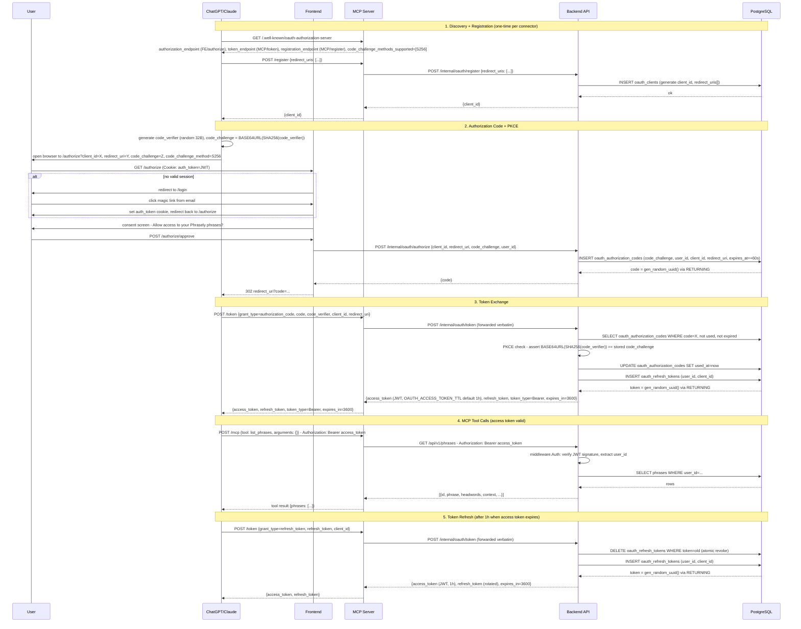

# MCP Server

Exposes `list_phrases`, `sample_phrases`, `explore_phrase`, `render_phrase_choices`, and `add_phrase` over MCP (Streamable HTTP), backed by the private `backend` API. Deployed as a separate public Railway service alongside `frontend`.

## Architecture

`mcp` is a thin public adapter in front of the private `backend` API. It has no direct
DB connection and shares no Go `internal/` packages with `backend` — it is purely an HTTP
client of the private API, the same role `frontend/api.go` plays.

```
Internet
   │ HTTPS
   ▼
┌─────────────────────────────────────────────────┐
│  MCP server (public)        Frontend (public)   │
│  mcp:8081                   frontend:3000        │
└───────────────┬─────────────────────┬───────────┘
                │ internal network    │
                ▼                     ▼
        ┌───────────────────────────────────┐
        │         API (private)             │
        │         backend:8080              │
        └───────────────────────────────────┘
                        │
                        ▼
                  PostgreSQL
```

Tool calls forward the caller's Bearer JWT straight through to `backend`, so
`middleware.Auth` and per-`user_id` scoping work unchanged — `mcp` never inspects JWT
internals beyond passing the header along.

## Auth: OAuth 2.1 + PKCE

In production, access to a user's collection goes through OAuth 2.1. MCP initialization, `tools/list`, the stateless `explore_phrase` and `render_phrase_choices` tools, and the phrase-choice UI resource are public; collection-backed tool calls require `Authorization: Bearer <access_token>` and return an `mcp/www_authenticate` challenge when the token is missing, invalid, or expired. For local ad-hoc testing, a magic-link JWT works directly as the Bearer token (see [mcp/README.md](../mcp/README.md)).

OAuth *logic and storage* (tables, code generation, token minting) live in `backend`.
The *endpoints that clients call directly* are hosted/proxied by `mcp` — calling `backend`
internally for the actual work.

### Discovery endpoints (hosted by `mcp`)

- `/.well-known/oauth-authorization-server` (RFC 8414) — advertises `/authorize` (on
  `frontend`), `/token` and `/register` (on `mcp`), PKCE method (`S256`).
- `/.well-known/oauth-protected-resource` (RFC 9728) — points the MCP resource at the
  auth server above.

### Dynamic Client Registration — `POST /register` (proxied to `backend`)

Client POSTs a `redirect_uris` array (RFC 7591), gets back a `client_id` (public client, no secret —
PKCE is mandatory). Redirect URIs are pinned at registration and validated on every
`/authorize` call (open-redirect defense).

### `/authorize` (frontend, public)

If the request has a valid `auth_token` cookie (existing magic-link session), shows a
consent screen ("Allow access to your Phrasely phrases?") and issues an authorization
code via an internal call to `backend`. If not logged in, redirects into the magic-link
flow, then bounces back to `/authorize` to complete.

### `/token` (proxied to `backend`)

Client POSTs `grant_type=authorization_code`, `code`, `code_verifier`, `client_id`, and `redirect_uri`. `backend` validates the PKCE challenge, marks the code used, and mints:
- **access_token** — JWT (1h expiry), same format as `auth.signJWT`, so `middleware.Auth`
  works unchanged.
- **refresh_token** — DB-persisted for revocation and rotation.

Refresh token rotation is enforced: old token is atomically revoked, new one issued on
every `refresh_token` grant.

### DB tables (in `backend`)

| Table | Purpose |
|---|---|
| `oauth_clients` | `client_id`, pinned `redirect_uris[]`, `created_at` |
| `oauth_authorization_codes` | `code`, `client_id`, `user_id`, `redirect_uri`, `code_challenge`, `expires_at` (~60s), `used_at` |
| `oauth_refresh_tokens` | long-lived tokens for rotation and revocation |

## Full auth flow



**Why PKCE?** Clients like ChatGPT and Claude Desktop are public clients that cannot
keep a `client_secret`. PKCE fixes the interception risk: the `code_challenge` (SHA-256
hash) is sent upfront; the `code_verifier` (the pre-image) is sent only at token
exchange. An intercepted `code` is useless without the `code_verifier`.

## MCP tools

| Tool | Purpose | Backend call |
|---|---|---|
| `list_phrases(headword?)` | List the user's saved phrases, optionally filtered by headword | `GET /api/v1/phrases` |
| `sample_phrases(count?)` | Randomly pick N phrases (1–10) for practice or quizzing | `GET /api/v1/phrases/random` |
| `explore_phrase(phrase)` | Return learning instructions for understanding an expression and generating memorable contexts — no backend call, no data persisted | — |
| `render_phrase_choices(choices)` | Render three save-ready cards: two target-expression contexts and one learning connection — no backend call, no data persisted | — |
| `add_phrase(phrase, headwords, note?, source_urls?)` | Save a finished phrase constructed locally by the assistant | `POST /api/v1/phrases` |

### Exploration and save flow

Exploration, presentation, and saving are separate stages:

1. When the user wants to understand or explore an expression, the assistant calls `explore_phrase(phrase)` and applies the returned learning instructions conversationally. Nothing is persisted.
2. After generating the refined original context, one memorable alternative, and one categorized learning connection, the assistant passes all three as save-ready `choices` to `render_phrase_choices`. Card 3 may use different headwords when it teaches a connected word or expression. Rendering does not express save intent and does not persist anything.
3. In clients that support MCP Apps, the user can click Save on any card. The component calls `add_phrase` through `tools/call`, then displays the authoritative success or error state. It never calls the private backend directly and never receives the OAuth token.
4. In clients without UI support, choices remain numbered and the user can select one conversationally. The assistant then calls `add_phrase` as before.
5. When the user's initial request already contains a direct, unambiguous save instruction, the assistant skips exploration and rendering, constructs the finished entry, and calls `add_phrase` directly.

`add_phrase` is persistence-only — it does not call OpenAI or enrich the entry itself.

## Phrase-choice MCP Apps UI

The phrase-choice component is a versioned MCP resource:

- URI: `ui://phrasely/phrase-choices-v2.html`
- MIME type: `text/html;profile=mcp-app`
- Source: `mcp/ui/phrase-choices.html`, embedded into the MCP binary with `go:embed`
- Owner: only `render_phrase_choices` references the resource through `_meta.ui.resourceUri`

The render tool returns the same three `choices` in `structuredContent` that the
component consumes. Each choice contains `phrase`, `headwords`, optional `note`,
optional `source_urls`, a short label, and an optional `recommended` flag. Choice
3 uses its label for the connection category and its note to explain the
relationship. The component treats all structured content as untrusted and
constructs the DOM with text nodes rather than injecting HTML.

Save is an app-initiated call to `add_phrase`. The tool remains available to
the model for conversational saves and is additionally visible to the MCP app.
Its existing OAuth wrapper forwards the request Bearer token to the backend and
returns `mcp/www_authenticate` for a missing or rejected token. UI state such as
Saving, Saved, and Retry is ephemeral; PostgreSQL remains the source of truth.

The component has no external scripts, styles, images, or API requests, so the
resource CSP declares empty connection and resource-domain allowlists. Clients
that ignore MCP Apps metadata still receive useful structured and text results.
On load, the component completes the MCP Apps `ui/initialize` /
`ui/notifications/initialized` handshake before using `tools/call`; ChatGPT's
`window.openai.callTool` bridge is retained as a compatibility path.

## Local testing

See [mcp/README.md](../mcp/README.md) for local setup, quick JWT testing, MCP Inspector
usage, and Claude Desktop configuration.
