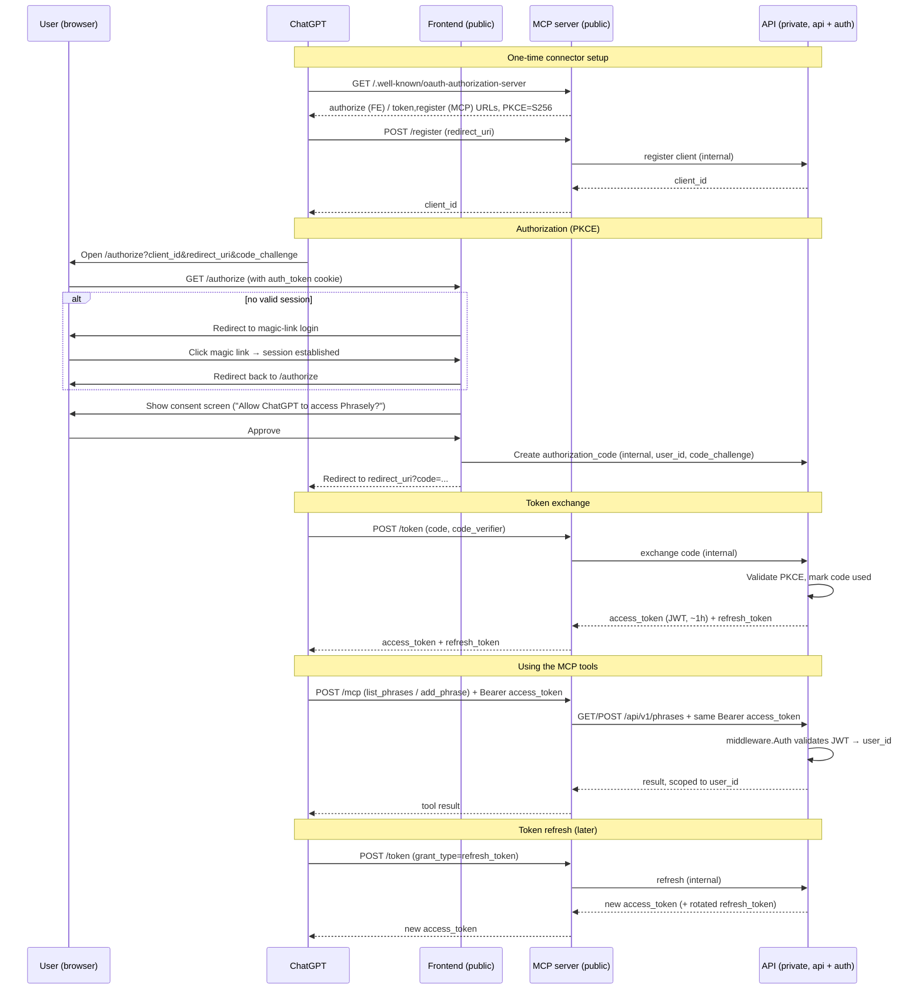
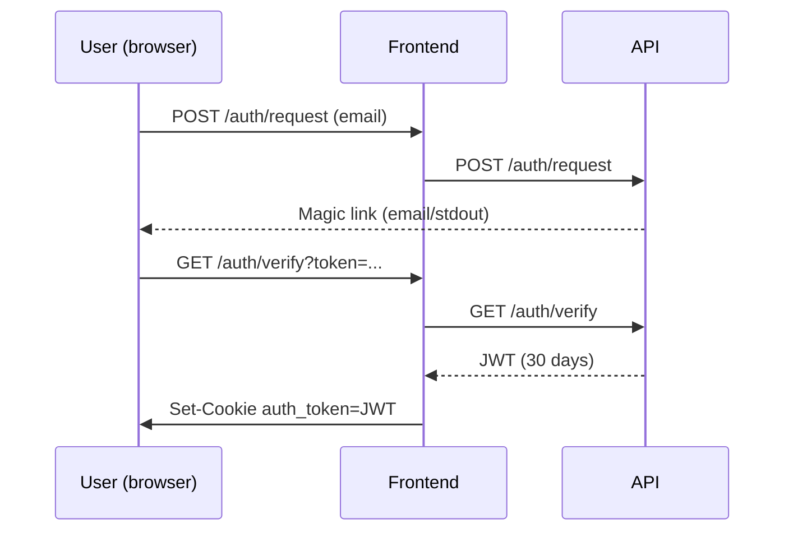

# MCP Server Plan

Goal: expose `list_phrases` and `add_phrase` over MCP (Streamable HTTP) so Phrasely can be
added as a ChatGPT connector, with the same per-user scoping and security guarantees as the
REST API.

## Architecture decision: MCP as a separate, public service

- New top-level `mcp/` folder (sibling to `backend/` and `frontend/`), its own Go module, own
  `Dockerfile`, deployed as its own Railway service with a **public** domain — the only other
  publicly reachable component besides `frontend`.
- `backend` (api + auth) stays **private**, exactly as today.
- `mcp` does **not** share Go `internal/` packages with `backend` and has **no direct DB
  connection**. Instead it's an HTTP client of the private API over the internal network —
  the same role `frontend/api.go` already plays. This avoids Go's `internal/` import
  restriction entirely and keeps `mcp` genuinely decoupled (matches how MCP servers for
  Linear/Notion-style products are typically built: a thin public adapter in front of an
  existing private API).
- Tool calls forward the caller's Bearer JWT straight through to `backend`, so
  `middleware.Auth` and per-`user_id` scoping work unchanged — `mcp` never needs to know
  about JWT internals beyond passing the header along.

## Phase 1 — MCP server with static token auth

- `mcp/` implements an MCP Streamable HTTP server using a Go MCP SDK (`mark3labs/mcp-go` or
  `modelcontextprotocol/go-sdk`).
- Two tools, each a thin translation to a `backend` REST call:
  - `list_phrases(headword?)` → `GET /api/v1/phrases` on `backend` (internal URL, e.g.
    `http://api.railway.internal:8080`)
  - `add_phrase(...)` → `POST /api/v1/phrases` on `backend`, optionally piped through
    `/api/v1/phrases/curate` first
- Auth: a static long-lived JWT (same format as `auth.signJWT`) works for local testing via
  MCP Inspector or Claude Desktop config (`http://localhost:<mcp-port>/mcp`). `mcp` passes
  this JWT as `Authorization: Bearer <token>` on its calls to `backend` — no new
  authorization logic needed.

**Outcome of Phase 1**: working MCP server, testable end-to-end locally against the
docker-compose stack, but not yet usable as a ChatGPT connector (ChatGPT requires OAuth).

## Phase 2 — OAuth 2.1 + Dynamic Client Registration

Required for ChatGPT's remote connector flow. Reuses the existing JWT format and the
frontend's `auth_token` cookie / magic-link login — no new login mechanism.

OAuth *logic and storage* (tables, code generation, token minting) live in `backend`, since
that's where `auth.signJWT` and the DB already are. But the *endpoints ChatGPT calls directly*
must be public, so `mcp` hosts/proxies them — calling `backend` internally for the actual
work, the same pattern as the two tools in Phase 1.

### 1. Discovery endpoints (hosted by `mcp`, public)
- `/.well-known/oauth-authorization-server` (RFC 8414) — advertises `/authorize` (on
  `frontend`), `/token` and `/register` (on `mcp`, proxied to `backend`), PKCE method
  (`S256`).
- `/.well-known/oauth-protected-resource` (RFC 9728) — points the MCP resource at the auth
  server above.

### 2. Dynamic Client Registration — `/register` (hosted by `mcp`, proxied to `backend`)
- ChatGPT POSTs its `redirect_uri`, gets back a `client_id` (public client, no secret —
  PKCE is mandatory).
- New `oauth_clients` table in `backend`'s DB: `id, redirect_uris[], created_at`. Redirect
  URI is pinned at registration and validated on every `/authorize` call (open-redirect
  defense).

### 3. `/authorize` (frontend, public — unchanged)
- If the request has a valid `auth_token` cookie (existing magic-link session), show a
  one-time consent screen ("Allow ChatGPT to read/add your Phrasely phrases?") and issue an
  authorization code via an internal call to `backend`.
- If not logged in, redirect into the existing magic-link flow, then bounce back to
  `/authorize` to complete.
- New `oauth_authorization_codes` table in `backend`: `code, client_id, user_id,
  redirect_uri, code_challenge, expires_at (~60s), used_at` — single-use, short-lived.

### 4. `/token` (hosted by `mcp`, proxied to `backend`)
- ChatGPT POSTs `code` + PKCE `code_verifier` to `mcp`, which forwards to `backend`.
  `backend` validates the challenge, marks the code used, and mints:
  - **access_token** — same JWT format as `auth.signJWT`, so `middleware.Auth` works
    unchanged. Consider a shorter expiry (e.g. 1h) than the 30-day cookie tokens.
  - **refresh_token** — new `oauth_refresh_tokens` table in `backend` for revocation and
    rotation.

### New surface area
- 3 tables in `backend`'s DB: `oauth_clients`, `oauth_authorization_codes`,
  `oauth_refresh_tokens`
- `backend`: internal endpoints for code issuance, token minting/refresh, client
  registration (called by `frontend` and `mcp`, never exposed directly)
- `mcp`: public discovery, `/register`, `/token` — each a small proxy to `backend`
- `frontend`: 1 new public route, `/authorize` (consent screen)
- MCP tool handlers from Phase 1 are unchanged — they only ever forward a Bearer JWT.

## Auth flow diagram (Phase 2)

Meanwhile, the **browser session** is a separate flow entirely:

Both JWTs (browser cookie and ChatGPT access token) are validated by the same
`middleware.Auth`, but are issued, stored, and revoked independently.

## Open question

Should the consent screen be a one-time "connect ChatGPT" action per user, or re-prompt
periodically? Affects whether we need an `oauth_consents` table or can treat any valid
session as implicit consent.

## Local testing

- Phase 1 (MCP protocol, tools, JWT auth) is fully testable locally: run `mcp` alongside the
  docker-compose stack, pointed at `http://localhost:8080` for `backend`, and connect MCP
  Inspector or Claude Desktop to `http://localhost:<mcp-port>/mcp`.
- Phase 2 (DCR → `/authorize` → consent → `/token`) can also be exercised locally end-to-end
  against local Postgres and the existing JWT secret — only the final "add as a ChatGPT
  connector" step needs a publicly reachable HTTPS URL for `mcp` and `frontend`, which is out
  of scope for now.
